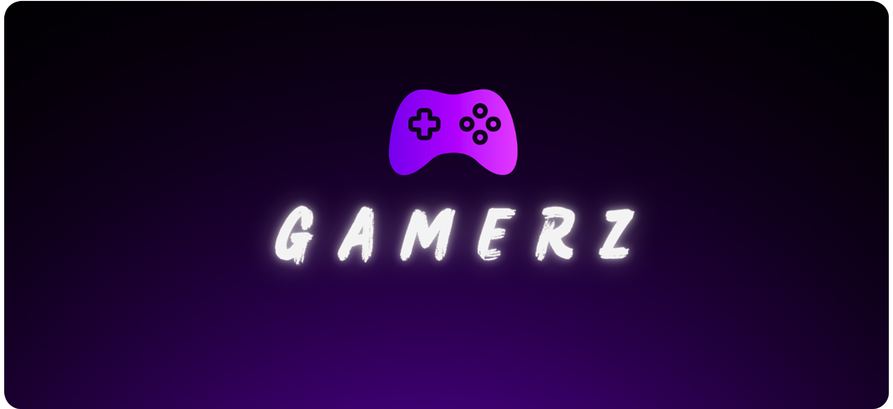

# 🎮GamerzOS

## GamerzOS For Gaming For Gamers

<head>
  <meta name="google-site-verification" content="XhHzqTShF13Xhz-NDwf-8IMU8cJtZ25cEKfXYVLMKog" />
</head>

<body>
  <h1 align="center">
    
  </h1>

  •
  <a href="https://www.youtube.com/@MR.PC_GAMER_YT" target="_blank">YouTube</a>
  •
  <a href="https://gamerzos-bymrpcgameryt.on.drv.tw/GamerzOS.html" target="_blank">Installation Guide</a>
  •

  
### 📈 Optimized Performance

GamerzOS strikes a balance between performance and compatibility. It implements numerous meaningful changes to improve Windows performance and responsiveness without breaking essential features. GamerzOS will not do tweaks for a placebo effect or marginal gains, making GamerzOS more stable and compatible.

### 🔍 Open Source and Transparent

Unlike custom Windows ISOs, Atlas is more straightforward to audit due to the use of [AME Wizard](https://ameliorated.io). AME Wizard is controlled by Playbooks, a customizable script-esque system that can perform various tasks.

Playbooks are renamed **.zip** archives, with the password [`malte`](https://docs.ameliorated.io/developers/getting-started/creation.html). As they primarily consist of plain text, Playbooks enable transparency, unlike custom Windows ISOs, which have many entry points for malicious activity. The few binaries in the Playbook are open source in our [`GamerzOS` repository](https://github.com/GamerzOS/GamerzOS).

Although the GUI is not open source for AME Wizard, AME Wizard's entire backend (called [TrustedUninstaller](https://github.com/Ameliorated-LLC/trusted-uninstaller-cli)) is open source under MIT, which contains each action used to run Atlas. The Atlas Playbook is open source under the [GPLv3 license](https://github.com/GamerzOS-Playbook/GamerzOS/blob/GamerzOS/LICENSE).

### 🔒 Legal Compliance

As GamerzOS doesn't redistribute a modified Windows ISO, it complies with [Windows's Usage Terms](https://www.microsoft.com/en-us/useterms/#areaheading-uid6738235). In addition, GamerzOS does not alter activation in Windows.

### Vulnerability Reporting

At GamerzOS, our primary objective is to provide an optimal equilibrium between security, performance, and usability.

As GamerzOS is built on Windows, a proprietary operating system developed by Microsoft, we may not have solutions for security issues associated with Windows. Nonetheless, we are committed to addressing any security concerns caused by GamerzOS and welcome any enhancements made to the base Windows. We encourage the submission of GitHub issues and pull requests that relate to security vulnerabilities, as long as the solutions match our objective of having an equilibrium.

Should you discover any security flaws linked to the GamerzOS-specific software/tools or [AME Wizard](https://ameliorated.io) (i.e., anything not related to Microsoft), kindly notify us immediately through the appropriate channels. For AME Wizard, please visit the [website](https://ameliorated.io) to identify suitable contacts. For all other issues, report them to the corresponding GamerzOS repository as an issue.

Please note that some issues may not be rectifiable by us. If you come across a vulnerability in GamerzOS that is also present in the latest version of stock/vanilla Windows, please report it to Microsoft. For more information on reporting security vulnerabilities and pentesting, please visit the [Microsoft](https://www.microsoft.com/en-us/msrc/faqs-report-an-issue) website. We wish you the best of luck in your reporting endeavor.

### Cridits

@xyueta, @radnotred, @gamerzos
</body>
